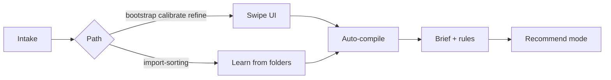

# Email Swipe

**Teach your AI agent how you sort email — in minutes, not hours.**

Swipe left (don't keep), right (keep), or double-tap (important). Your agent gets a human-readable brief plus machine-readable rules it can actually use — without you writing filters by hand.

**Try it:** [emailaiguy.com](https://emailaiguy.com/) · **Repo:** [github.com/EmailGuy42069/email-swipe](https://github.com/EmailGuy42069/email-swipe)

## How it works



## What you get (the value)

| After one session | What it means for you |
|-------------------|----------------------|
| **assistant-brief.md** | Plain-English summary you can read and correct with your agent |
| **policy-graph.json** | Structured rules (senders, folders, autonomy level) |
| **platform-rules.json** | Label/folder suggestions for Gmail, Outlook, etc. — inbox stays visible unless you approve |
| **training-pack.json** | Slim runtime slice so your agent doesn't burn tokens on raw swipe data |

**Default mode is recommend-only** — your agent suggests what to do; it does not auto-delete, archive, or skip your inbox without approval.

**Not for:** Replacing your mail client, silent auto-archive, or hands-off automation with no agent.

## Four ways to train (pick what fits)

| Path | Best for | UI? |
|------|----------|-----|
| **Bootstrap** | First time — learn from a swipe sample | Yes |
| **Calibrate** | You already have rules — fix edge cases only | Yes |
| **Refine** | Prior training but gaps remain | Yes |
| **Import sorting** | Folders already organized — learn from them | No (agent-only) |

Your agent runs an intake conversation first, recommends a path, and you choose. See [SKILL.md](SKILL.md) and [references/intake-router.md](references/intake-router.md).

**60-second start:** [references/QUICKSTART.md](references/QUICKSTART.md)

**Before & after:** [your-agent-before-and-after.md](references/your-agent-before-and-after.md) · **Multiple mailboxes:** enable Unified inbox in **Advanced settings** → [unified-inbox.md](references/unified-inbox.md)

## Local-first, any stack

Email Swipe runs on **your machine** by default. Training artifacts persist in `~/.config/email-swipe/` — no cloud account required.

You bring your own **agent** (Cursor, OpenClaw, Claude Code, any MCP client) and **mail access** (Gmail MCP, `gog`, IMAP, Microsoft Graph, etc.). Remote UI access (phone on Wi‑Fi, tunnel, VPS) is optional; see [deployment.md](references/deployment.md).

## Setup matrix

| Level | One-sentence meaning | What you need |
|------|-----------------------|---------------|
| **Works out of the box (demo)** | You can open the local swipe UI immediately with sample emails, but the session is a practice run and not based on the user's real mailbox yet. | Repo + Python + browser |
| **Works with real email** | You can train on actual inbox messages because the agent has a verified way to fetch mail, inject it, and guide the session. | Repo + Python + browser + any mail access method |
| **Advanced / import-sorting only** | The agent skips swiping and learns from folders or labels the user already organized, which requires trusted mailbox folder access and a review step first. | Mail + folder/label access via your provider tools |

## Quick start (try the UI)

```bash
git clone https://github.com/EmailGuy42069/email-swipe.git
cd email-swipe
python scripts/serve-ui.py
```

Open the **Desktop URL** printed by the server — demo emails load if none are injected. There is only one UI (`index.html`); "demo" means sample mail, not a separate page.

Optional: `python scripts/setup-agent.py` to set your agent's name in the UI.

## Quick start (agent / Cursor skill)

**Evaluator demo (skip intake):**

```bash
python scripts/session-intake.py demo
python scripts/serve-ui.py
```

**Full flow:** See [AGENTS.md](AGENTS.md) or [references/QUICKSTART.md](references/QUICKSTART.md).

Agents: call MCP **`get_skill_context`** on activation (or `session-intake.py assess`) before anything else.

1. Install or clone this repo and add MCP (see [references/post-training-flow.md](references/post-training-flow.md)):
   ```json
   {
     "mcpServers": {
       "email-swipe": {
         "command": "python3",
         "args": ["/path/to/email-swipe/scripts/watch-preferences.py"]
       }
     }
   }
   ```
2. Activate the skill — agent runs **intake** (`session_intake_assess` → discovery → recommend → you confirm a path).
3. Train (swipe UI, or `learn_from_folders` for import-sorting).
4. Agent presents **assistant-brief.md** and enters recommendation mode.

Full agent lifecycle: **[SKILL.md](SKILL.md)**

## How it works (detail)

```
Intake (agent asks a few questions → you pick a path)
    ↓
Train (swipe UI and/or learn from existing folders)
    ↓
Auto-compile → assistant-brief + policy-graph + platform-rules
    ↓
Agent reads brief with you → recommends on new mail (no auto-actions)
```

Artifacts live in `~/.config/email-swipe/` on the machine running `serve-ui.py`. When that server is active, compilation happens automatically at session end — no manual export step. Hosting the UI on ephemeral cloud infrastructure without durable storage is **not** the default path; see [deployment.md](references/deployment.md).

## Advanced folder routing

Unlock in **Advanced settings** in the UI: route mail to named folders using **AI rules** (plain English), **smart categories** (promotions, receipts…), or **strict** keyword/domain matches. Routes compile into platform-rules for your agent to build out as labels.

Details: [references/paths/advanced-folders.md](references/paths/advanced-folders.md)

## Project structure

```
email-swipe/
├── README.md                # Human value prop (start here on GitHub)
├── AGENTS.md                # Agent activation checklist
├── SKILL.md                 # Agent skill entry (Cursor/OpenClaw)
├── assets/ui/               # Swipe interface
├── scripts/
│   ├── serve-ui.py          # Local UI + auto-compile API
│   ├── watch-preferences.py # MCP server
│   ├── compile_training.py  # Shared compile entrypoint
│   ├── session-intake.py    # Intake router (four paths + demo)
│   ├── fetch_folder_snapshot.py # Gmail folder snapshot for import-sorting
│   ├── learn_from_folders.py # No-UI path from existing folders
│   └── advanced/            # Optional Gmail fetch scripts
└── references/              # Runbooks, examples, deployment
    ├── QUICKSTART.md        # 60-second agent + human start
    ├── intake-router.md
    ├── post-training-flow.md
    └── paths/               # Per-path agent runbooks
```

## Docs map

| Audience | Read this |
|----------|-----------|
| **Human browsing GitHub** | This README → [QUICKSTART](references/QUICKSTART.md) |
| **Landing / overview** | [emailaiguy.com](https://emailaiguy.com/) |
| **Agent on activation** | [AGENTS.md](AGENTS.md) → [SKILL.md](SKILL.md) → [intake-router.md](references/intake-router.md) |
| **After training** | [post-training-flow.md](references/post-training-flow.md) |
| **Deploy / mail access** | [deployment.md](references/deployment.md), [email-access.md](references/email-access.md) |
| **Settings UI (design)** | [docs/ADVANCED-SETTINGS-SPEC.md](docs/ADVANCED-SETTINGS-SPEC.md) |
| **Remote / always-on UI** | [remote-access-power-user.md](references/remote-access-power-user.md) |
| **Quality / release checks** | [docs/LEARNING-AUDIT.md](docs/LEARNING-AUDIT.md) |

## Privacy

- The UI never calls email APIs directly.
- `preferences.json` contains sender/subject snippets — treat as sensitive.
- Agents should use the brief + training-pack at runtime, not full swipe history in prompts.

## License

MIT
