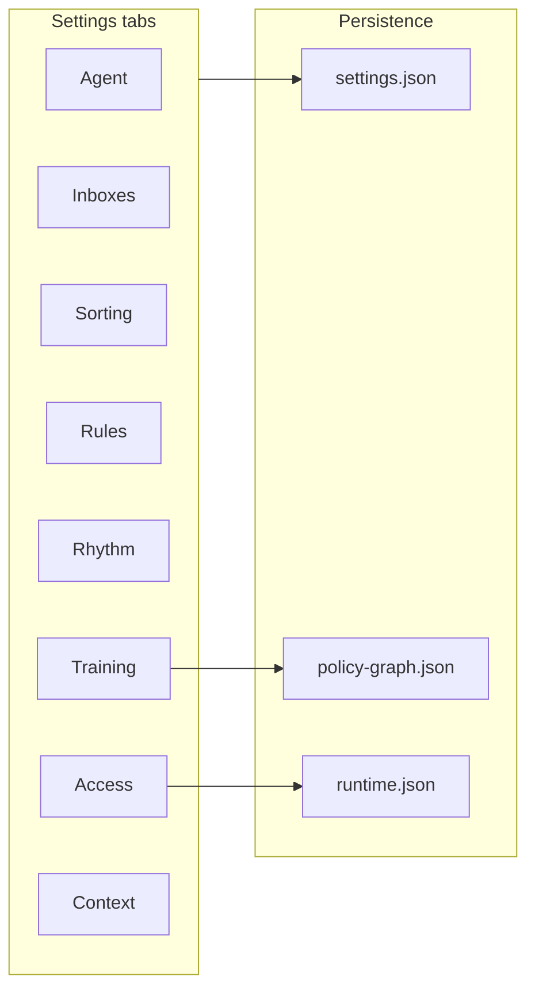
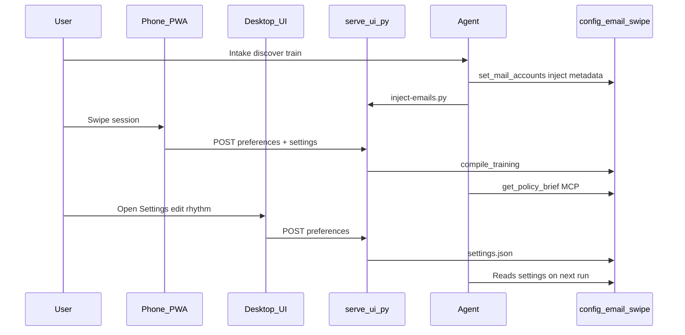

# Advanced Settings — Product Spec

**Status:** Design spec (Phase 2 UI)  
**Audience:** Product, UI implementers, agent runbook authors  
**Related:** [unified-inbox.md](./unified-inbox.md) · [your-agent-before-and-after.md](./your-agent-before-and-after.md) · [deployment.md](./deployment.md) · [post-training-flow.md](./post-training-flow.md)

---

## Purpose

The current **Agent** sheet is a single scroll panel with three toggles. Users need one place to see and control how Email Swipe trains, how their agent behaves afterward, and how they reach the UI on phone or desktop — without turning this into a mail client or a life-coaching form.

**Design goals**

1. **Robust but not overwhelming** — tabbed layout; simple path stays simple.
2. **Stack-agnostic** — works local-first; no required cloud vendor.
3. **Clear ownership** — each field is **User**, **Agent**, or **Both** (who writes it).
4. **Honest limits** — UI never fetches mail; agent never replaces the settings file without compile.

---

## Entry point

| Current | Target |
|---------|--------|
| Header button labeled **Agent** | Rename to **Settings** (gear icon); subtitle on first open: *"Training preferences & agent behavior"* |
| Single sheet | Full-screen panel on mobile; centered modal on desktop |
| Save at bottom | Per-tab dirty state + global **Save**; show compile status after save |

**When to show Advanced Settings**

- Anytime via header button (not only after training).
- Victory screen link: *"Tune agent behavior → Settings"*.
- Agent can say: *"Open Settings → Inboxes to confirm unified inbox is on."*

---

## Tab map (overview)



| Tab | One-line purpose | Primary owner |
|-----|------------------|---------------|
| **Agent** | Who your agent is and how autonomous it is | Both |
| **Inboxes** | Multiple mailboxes (unified inbox) | Both |
| **Sorting** | Swipe vs folder buttons; folder routes | User |
| **Rules** | Platform labels, urgency, safety rails | Both |
| **Rhythm** | Digests, summaries, check-in cadence | Both |
| **Training** | Sessions, scores, gaps, retrain | Both |
| **Access** | URLs, phone install, connection health | User |
| **Context** | Optional notes; agent-owned rich context | Agent (read-mostly in UI) |

---

## Tab 1 — Agent

**What users expect:** Name my agent, turn on post-training help, understand recommend-only vs more autonomy.

| Control | Type | Default | Owner | Persists to | Notes |
|---------|------|---------|-------|-------------|-------|
| Agent name | text | `""` | User | `settings.agent.name` | Shown in brief + victory screen |
| Let agent review inbox after training | toggle | off | User | `settings.agent.enabled` | Does not auto-fetch mail |
| Autonomy level | segmented | `recommend` | Both | `settings.agent.autonomyLevel` + `policy-graph.defaultAutonomyLevel` | Phase 4: `recommend` · `approve_batch` · `auto_safe` |
| Show autonomy explanation | link | — | — | doc | Opens autonomy tiers doc |
| Last brief | read-only + copy | — | System | `assistant-brief.md` | Fetch `/api/policy-brief` when server up |
| Agent host hint | read-only | — | Agent | — | *"Configured in Cursor / OpenClaw / …"* — not editable here |

**Agent interaction**

- `setup-agent.py` / env `AGENT_NAME` seeds name before first session.
- After compile, agent presents brief; autonomy changes should re-compile or update graph via MCP `update_settings` (future).
- **Hard rule:** autonomy above `recommend` requires explicit user toggle + confirm dialog.

---

## Tab 2 — Inboxes

**What users expect:** Multiple Gmail/Outlook/iCloud accounts; see which are trained.

| Control | Type | Default | Owner | Persists to | Notes |
|---------|------|---------|-------|-------------|-------|
| Unified inbox (multiple accounts) | toggle | off | User | `settings.unifiedInbox.enabled` | Unlocks multi-account UX |
| How unified inbox works | button → doc | — | — | `unified-inbox.html` | Required when toggle on (first time) |
| Account list | read-only table | `[]` | Agent | `settings.unifiedInbox.accounts[]` | Columns: label, provider, role, trained? |
| Default account | select | first | Both | `settings.unifiedInbox.defaultAccountId` | For inject when agent omits id |
| Add / edit accounts | CTA | — | Agent | — | *"Ask your agent to add a mailbox"* + copy JSON shape |
| Per-account train status | badge | — | System | compile + session history | Green = brief section exists |

**Agent interaction**

- MCP: `list_mail_accounts`, `set_mail_accounts` (implemented).
- UI does **not** OAuth mail — registration stays in chat.
- Inject batches must include `metadata.accountId`; header badge shows active mailbox.

**Not in UI (by design)**

- Passwords, OAuth tokens, IMAP credentials.

---

## Tab 3 — Sorting

**What users expect:** Simple swipe vs folder buttons; define where mail should go.

| Control | Type | Default | Owner | Persists to | Notes |
|---------|------|---------|-------|-------------|-------|
| Training mode | radio | `swipe` | User | `settings.folders.trainingMode` | `swipe` \| `folder_buttons` |
| Unlock advanced folder routing | toggle | off | User | `settings.folders.advancedRoutingEnabled` | Switches bottom UI |
| Folder complexity | select | minimal | User | `settings.folders.preference` | minimal / moderate / many |
| Folder routes editor | list | core 3 | User | `settings.folders.routes[]` | AI rule / Smart / Strict |
| Remember last folder | toggle | on | User | `settings.folders.rememberLastFolder` | Folder-mode UX |
| Urgent folder name | text | Needs Attention | User | `settings.folders.urgentFolderName` | Maps to watchlist |
| Include urgent folder | toggle | on | User | `settings.folders.includeUrgentFolder` | |
| Match mode legend | static | — | — | — | AI vs Smart vs Strict |

**Interaction with main UI**

| `advancedRoutingEnabled` | Main screen |
|--------------------------|-------------|
| off | Left / right / double-tap hints + action buttons |
| on | Folder action grid (max 5 per row); core routes editable |

**Agent interaction**

- Agent sets `folderJudgments` on inject for AI rules ([advanced-folders.md](./paths/advanced-folders.md)).
- Routes compile to `platform-rules.json` + `policy-graph.folderRoutingPolicies` on save/compile.
- Agent should read routes from `get_policy_graph` — not re-ask each session.

---

## Tab 4 — Rules

**What users expect:** Safety rails; what the agent is allowed to suggest vs do.

| Control | Type | Default | Owner | Persists to | Notes |
|---------|------|---------|-------|-------------|-------|
| Platform rules mode | select | suggest_only | User | `settings.platformRules.mode` | suggest_only · assist · (future execute) |
| Never remove from inbox | toggle | on | User | `settings.platformRules.neverRemoveFromInbox` | Inbox-preserving default |
| Allowed actions | checklist | label, star | User | `settings.platformRules.allowedActions[]` | |
| Forbidden actions | checklist | delete, skip_inbox, … | User | `settings.platformRules.forbiddenActions[]` | |
| Max suggested rules | number | 12 | User | `settings.platformRules.maxSuggestedRules` | Caps platform-rules noise |
| Urgent keywords | tag list | built-in set | Both | `policy-graph.keywordWatchPolicies` | UI edits → recompile |
| Learned rules preview | read-only | — | System | `platform-rules.json` | Top N suggestions |
| Import existing rules | CTA | — | Agent | calibrate path | *"Tell your agent your current filters"* |

**Agent interaction**

- Compiler enforces `forbiddenActions` in brief language.
- Agent builds labels in Gmail/Outlook from `platform-rules` — user approves in chat.
- Calibrate path imports verbal rules → seeded graph (agent runbook).

---

## Tab 5 — Rhythm

**What users expect:** How often the agent summarizes mail and checks in — not a full scheduler product.

| Control | Type | Default | Owner | Persists to | Notes |
|---------|------|---------|-------|-------------|-------|
| Inbox check-in frequency | select | `twice_daily` | User | `settings.agent.scanFrequency` | off · daily · twice_daily · weekly |
| Preferred check-in times | time chips | — | User | `settings.rhythm.preferredTimes[]` | e.g. 8:00, 17:00 — hints for agent |
| Digest style | select | `short` | User | `settings.rhythm.digestStyle` | short · detailed |
| Include in digest | checklist | needs_reply, promos, scores | User | `settings.rhythm.digestSections[]` | |
| Score trend in summary | toggle | on | User | `settings.rhythm.includeScoreTrend` | Uses session-history |
| Quiet hours | time range | off | User | `settings.rhythm.quietHours` | Agent should not ping (honor on agent side) |
| Channel preference | read-only | chat | Agent | — | *"Summaries in agent chat unless you use automations"* |

**Important**

- Email Swipe does **not** run cron or push notifications by itself.
- Rhythm settings are **instructions to the agent** + future MCP `get_rhythm_config`.
- User's agent (OpenClaw, Cursor, etc.) implements actual scheduling.

**Agent interaction**

- Post-training: agent proposes cadence in cementing conversation; user can mirror here.
- `get_session_status` + brief power digest content.

---

## Tab 6 — Training

**What users expect:** See progress, retrain, understand calibration.

| Control | Type | Default | Owner | Persists to | Notes |
|---------|------|---------|-------|-------------|-------|
| Last session summary | read-only | — | System | `session-complete.json` | Mode, account, swipe count |
| Score trend chart | chart | — | System | `session-history.json` | Same as victory screen |
| Agreement % (latest) | stat | — | System | `calibration.json` | |
| Needs more training | list | — | System | `policy-graph.trainingGaps` | Link to refine session |
| Intake path | read-only | — | System | `intake.json` | bootstrap / calibrate / … |
| Train again | button | — | User | — | Clears session cache; same inbox |
| Start refine session | CTA | — | Both | — | Agent injects low-confidence mail |
| Export training data | button | — | User | — | Existing Export; show compile status |
| Demo vs real mail | badge | — | System | session metadata | |

**Agent interaction**

- Agent drives inject + path; UI shows outcomes.
- Refine: agent uses calibration misses to build batch.

---

## Tab 7 — Access

**What users expect:** Open on phone from home screen; know if server is reachable.

| Control | Type | Default | Owner | Persists to | Notes |
|---------|------|---------|-------|-------------|-------|
| Explore remote access | toggle | off | User | `settings.access.exploreRemoteReachability` | Agent reads [remote-access-power-user.md](../references/remote-access-power-user.md) |
| Remote access options | button → doc | — | — | `remote-access.html` | Tailscale, VPS, tunnels — user-operated |
| Connection status | indicator | — | System | `runtime.json` | Server up / down |
| Desktop URL | display | dynamic | System | `runtime.json` | From serve-ui |
| Mobile URL (LAN) | display | dynamic | System | `runtime.json` | Same Wi‑Fi |
| Add to Home Screen | guided steps | — | User | — | See [remote-access-power-user.md](../references/remote-access-power-user.md) |
| Data location | read-only | `~/.config/email-swipe/` | — | — | |
| Reset session cache | button + confirm | — | User | IndexedDB | `?reset=1` equivalent |

**Not promised**

- Permanent public URL without user running tunnel/VPS.
- Native App Store / Play Store app (skill-only).

---

## Tab 8 — Context

**What users expect:** Some users want a notes field; most context should live in their agent.

| Control | Type | Default | Owner | Persists to | Notes |
|---------|------|---------|-------|-------------|-------|
| Problem to solve | text (short) | — | Both | `settings.context.problemToSolve` | From intake discovery |
| Optional user notes | textarea | — | User | `settings.context.notes` | Freeform |
| Job / life / projects | **hidden or read-only** | — | Agent | — | **Do not prompt** in Email Swipe |
| Agent context banner | static | — | — | — | *"Calendar, projects, and relationships — manage in your agent, not here."* |
| Discovery snapshot | read-only | — | System | `intake.json` discovery | For transparency |

**Policy (locked)**

- Email Swipe does **not** run a life-context interview.
- If the user's agent already has rich context, it uses that when applying rules — no duplicate forms.

---

## Settings schema (target `settings.json` v3)

```json
{
  "version": "3.0",
  "updatedAt": "ISO-8601",
  "agent": {
    "enabled": false,
    "name": "",
    "scanFrequency": "twice_daily",
    "autonomyLevel": "recommend"
  },
  "unifiedInbox": {
    "enabled": false,
    "defaultAccountId": null,
    "accounts": []
  },
  "access": {
    "exploreRemoteReachability": false
  },
  "folders": {
    "trainingMode": "swipe",
    "advancedRoutingEnabled": false,
    "preference": "minimal",
    "routes": [],
    "rememberLastFolder": true,
    "lastFolderId": null,
    "includeUrgentFolder": true,
    "urgentFolderName": "Needs Attention"
  },
  "platformRules": {
    "mode": "suggest_only",
    "neverRemoveFromInbox": true,
    "allowedActions": ["label", "star"],
    "forbiddenActions": ["delete", "skip_inbox", "auto_archive", "block_sender"],
    "maxSuggestedRules": 12
  },
  "rhythm": {
    "preferredTimes": ["08:00", "17:00"],
    "digestStyle": "short",
    "digestSections": ["needs_reply", "score_trend", "training_gaps"],
    "includeScoreTrend": true,
    "quietHours": null
  },
  "context": {
    "problemToSolve": "",
    "notes": ""
  }
}
```

Remove or deprecate unused `context.job` / `context.life` from UI (keep merge-compatible in backend).

---

## Agent ↔ UI interaction model

### Three surfaces



| Surface | Best for | Writes settings? | Reads artifacts? |
|---------|----------|------------------|------------------|
| **Swipe UI** | Training, folder routes, toggles | Yes (on Save → compile) | Session meta, brief on victory |
| **Settings panel** | All tabs | Yes | All via API when server up |
| **Agent (MCP/CLI)** | Accounts, inject, brief, rhythm via **agent spine** | `get_agent_spine`, `update_settings`, `set_mail_accounts` | Full |

### Source of truth (target)

| Data | Canonical | UI cache | Agent reads |
|------|-----------|----------|-------------|
| `settings.json` | `~/.config/email-swipe/` after compile | `localStorage` mirror | MCP + file |
| Swipes in progress | IndexedDB | — | Not until export/compile |
| `runtime.json` | Disk on server start | — | `get_session_status` |
| Rich life context | User's agent memory | **Not stored** | Agent only |

### Sync rules (avoid desync — audit P0-3)

1. On Settings open: `GET /api/settings` → merge into form (implement).
2. On Save: `POST /api/preferences` or `POST /api/settings` → compile → refresh status chip.
3. On boot: prefer server `settings.json` over stale `localStorage` if server reachable.
4. Agent after `set_mail_accounts`: tell user to refresh Settings or auto-push via WebSocket (future).

### MCP tools (existing + planned)

| Tool | Status | Tab |
|------|--------|-----|
| `get_skill_context` | done | all |
| `list_mail_accounts` / `set_mail_accounts` | done | Inboxes |
| `get_policy_brief` / `get_policy_graph` | done | Agent, Rules, Training |
| `get_session_status` | done | Training, Rhythm |
| `get_settings` | done | all |
| `update_settings` | done | Agent, Rules, Rhythm, Context |
| `get_agent_spine` | done | all (preferred read) |
| `get_rhythm_config` | **planned** | Rhythm |

### What the agent should say

- *"I added your work Gmail in Settings → Inboxes. Next I'll inject a batch tagged `work-gmail`."*
- *"Your rhythm is set to twice daily — I'll summarize in chat at 8am and 5pm if you ping me or use your scheduler."*
- *"Autonomy is recommend-only; I won't archive anything until you change Settings → Agent."*

---

## Mobile & Add to Home Screen

### Can the UI sit on the phone home screen?

**Yes — as a PWA shortcut to the local (or tunneled) server**, not as a standalone mail app.

Existing pieces:

- [`manifest.json`](../assets/ui/manifest.json): `display: standalone`, portrait
- [`serve-ui.py`](../scripts/serve-ui.py): prints **Mobile URL** (LAN IP + port)
- [`runtime.json`](../scripts/session_state.py): desktop + mobile URLs

### Three access patterns (stack-agnostic)

| Pattern | Home screen? | Mail data | Best for |
|---------|--------------|-----------|----------|
| **A. LAN PWA** | Add to Home Screen → Mobile URL | On laptop running `serve-ui.py` | Couch swiping, same Wi‑Fi |
| **B. Tunnel PWA** | Bookmark tunnel URL → Add to Home Screen | Still on user's machine behind tunnel | Phone away from desk |
| **C. Desktop only** | No install | Local | Mouse/keyboard training |

**Pattern A (recommended default for phone)**

1. Laptop: `python scripts/serve-ui.py`
2. Phone (same Wi‑Fi): open **Mobile URL** from terminal or Settings → Access
3. Safari iOS: Share → **Add to Home Screen**
4. Android Chrome: Menu → **Install app** / Add to Home Screen
5. Icon opens full-screen swipe UI (`standalone`)

**Constraints (be honest in UI)**

| Constraint | Impact |
|------------|--------|
| Server must be running | Home screen icon fails if laptop asleep / server stopped |
| Dynamic port | Re-add bookmark if port changes unless using `runtime.json` refresh |
| iOS PWA | Requires HTTPS **or** LAN exception; localhost not on phone |
| No push from Email Swipe | Digests happen in **agent chat**, not APNS |
| No offline mail | PWA shell can cache; mail requires inject + server |

### PWA hardening (implementation backlog)

| Item | Priority | Notes |
|------|----------|-------|
| `GET /api/settings` + status | P1 | Settings tab connection indicator |
| Service worker (shell only) | P2 | `index.html`, css, js — not `emails.json` |
| `manifest` `start_url` with stable query | P2 | `/?source=homescreen` |
| Apple touch icons 180/192/512 | P2 | Professional home screen icon |
| Settings → Access install wizard | P1 | iOS vs Android steps |
| `runtime.json` poll on app focus | P2 | Recover when port changes |
| Optional Tailscale/ngrok doc link | P3 | Pattern B |

### Delicate balance: accessible vs efficient

| Principle | Implementation |
|-----------|----------------|
| **Don't require install** | Browser URL always works |
| **Don't require cloud** | LAN-first; tunnel optional |
| **One tap after setup** | Home screen → last Mobile URL |
| **Agent sets up once** | Agent prints Mobile URL + walks Add to Home Screen |
| **Don't fake native** | No app store promise; PWA + agent digests |
| **Live interaction** | User swipes live against injected batch; agent compiles on save |

**Live loop on phone**

1. Agent injects fresh batch → user opens home screen icon
2. User swipes → Save notes → compile on laptop disk
3. Agent `get_session_status` → presents brief in chat
4. Optional: user opens Settings → Rhythm on phone

---

## Normal UI vs Advanced Settings — division of labor

| Concern | Normal swipe screen | Advanced Settings |
|---------|---------------------|-----------------|
| Triage gestures | Primary | Sorting tab configures mode |
| Progress / victory | Primary | Training tab deep link |
| Folder pick (advanced mode) | Primary | Sorting tab defines routes |
| Agent name | — | Agent tab |
| Multi-inbox | Badge only | Inboxes tab |
| Rules / autonomy | — | Rules + Agent tabs |
| Digests / schedule | — | Rhythm tab |
| Phone install | — | Access tab |
| Brief / scores | Victory summary | Training + Agent tabs |

**Rule:** Nothing critical only in Settings — training must work with zero settings changes (demo path).

---

## Implementation phases

| Phase | Scope |
|-------|--------|
| **2a** | Tab shell + rename Agent → Settings; migrate existing controls |
| **2b** | Access tab + PWA install copy; `GET /api/settings` |
| **2c** | Training tab (session status API); Rhythm tab (schema only) |
| **2d** | Rules tab + autonomy UI (Phase 4 doc) |
| **2e** | Inboxes account table (read-only + agent CTA) |
| **2f** | Context tab (notes only + agent banner) |
| **3** | `get_settings` / `update_settings` MCP; service worker | **done** |

---

## Docs to link from Settings UI

| Doc | Tab |
|-----|-----|
| [unified-inbox.md](./unified-inbox.md) | Inboxes |
| [your-agent-before-and-after.md](./your-agent-before-and-after.md) | Agent |
| [advanced-folders.md](./paths/advanced-folders.md) | Sorting |
| [post-training-flow.md](./post-training-flow.md) | Agent, Rhythm |
| [deployment.md](./deployment.md) | Access |
| `autonomy-levels.md` (Phase 4) | Agent, Rules |

---

## Open questions

1. **Allow user to add accounts in UI** without agent, or keep agent-only registration?  
   *Recommendation:* read-only list + "Ask your agent" for v1; reduces OAuth scope creep.

2. **Push notifications** — out of scope; confirm rhythm is agent-scheduled only.

3. **Settings without server** — if user opens `index.html` as file://, show degraded Settings with export-only save.  
   *Recommendation:* banner "Start serve-ui.py for full settings sync."

---

## Acceptance criteria (Settings v2)

- [ ] Eight tabs implemented with controls above (or marked "coming soon" with doc link).
- [ ] User can install PWA from Access tab instructions on iOS + Android.
- [ ] Save shows compile success/failure (P1-1).
- [ ] Agent and UI converge on `~/.config/email-swipe/settings.json`.
- [ ] No life-context interview fields in UI.
- [ ] Single-account users can ignore Inboxes tab entirely.
