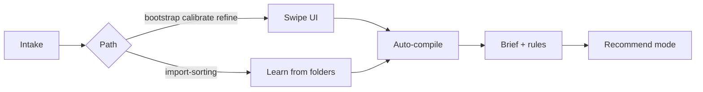

# Quickstart (60 seconds)

**What this is:** Train your AI agent how you sort email — swipe or import existing folders — get a brief + rules. Recommend-only by default (no auto-delete).

**Who this is NOT for:** People who want a mail client replacement, silent auto-archive, or zero agent involvement.

---

## Setup matrix

| Level | One-sentence meaning |
|------|-----------------------|
| **Works out of the box (demo)** | You can open the local swipe UI right away with sample emails, but the results are only a practice run and not based on your actual mailbox. |
| **Works with real email** | The agent can fetch real inbox mail, load it into the UI, and train on your actual sorting preferences. |
| **Advanced / import-sorting only** | The agent learns from folders you already use instead of swiping, which needs mailbox folder access and an explicit preview/review step. |

---

## Human — try the UI now

```bash
git clone https://github.com/EmailGuy42069/email-swipe.git
cd email-swipe
python scripts/serve-ui.py
```

Open the **Desktop URL** printed by the server (not a fixed port) — demo mail loads automatically if no batch was injected.

Swipe ← don't keep · → keep · double-tap important. When done, artifacts save to `~/.config/email-swipe/`.

**Learn more:** [README](../README.md) · [Landing page](https://emailaiguy.com/)

---

## Agent — evaluator demo (no intake, no real mail)

**First:** MCP `get_skill_context` (or `python scripts/check-ready.py --json`) — confirms one UI, no demo.html.

Fastest path to show value:

```bash
python scripts/session-intake.py demo
python scripts/serve-ui.py
```

Then tell the user to open the printed Desktop URL, swipe demo mail, and fetch `get_session_status` + `get_policy_brief` after the session.

---

## Agent — full flow (6 commands)

```bash
# 1. Assess + get discovery questions
python scripts/session-intake.py assess

# 2. Save answers from chat (example)
python scripts/session-intake.py discover '{"hasExistingRules":false,"demoFirst":true}'

# 3. Recommend a path — present all four options to the user
python scripts/session-intake.py recommend

# 4. User picks → lock path (bootstrap | calibrate | refine | import-sorting)
python scripts/session-intake.py confirm bootstrap

# 5. Inject mail + start UI (bootstrap example)
python scripts/inject-emails.py path/to/batch.json   # or use demo after `demo` command
python scripts/serve-ui.py

# 6. After session — fetch brief and cement with user
# MCP: get_policy_brief  OR  read ~/.config/email-swipe/assistant-brief.md
```

**MCP equivalent:** `get_skill_context` → `session_intake_assess` → `discover` → `recommend` → `confirm` → inject → `get_policy_brief`

---

## Agent — import-sorting (no UI)

User's folders are already organized:

```bash
python scripts/session-intake.py confirm import-sorting

# Fetch snapshot (Gmail via gog)
python scripts/fetch_folder_snapshot.py -o folders.json --per-folder 10

# Preview plan — review WITH user before applying
python scripts/learn_from_folders.py folders.json --preview

# Apply after user confirms
python scripts/learn_from_folders.py folders.json
```

---

## Where to go next

| Need | Doc |
|------|-----|
| Full intake flow | [intake-router.md](intake-router.md) |
| After training | [post-training-flow.md](post-training-flow.md) |
| Per-path steps | [paths/](paths/) |
| Advanced folders | [paths/advanced-folders.md](paths/advanced-folders.md) |
| Mail access setup | [email-access.md](email-access.md) |
| Agent activation | [AGENTS.md](../AGENTS.md) or [SKILL.md](../SKILL.md) |

---

## Flow (overview)


