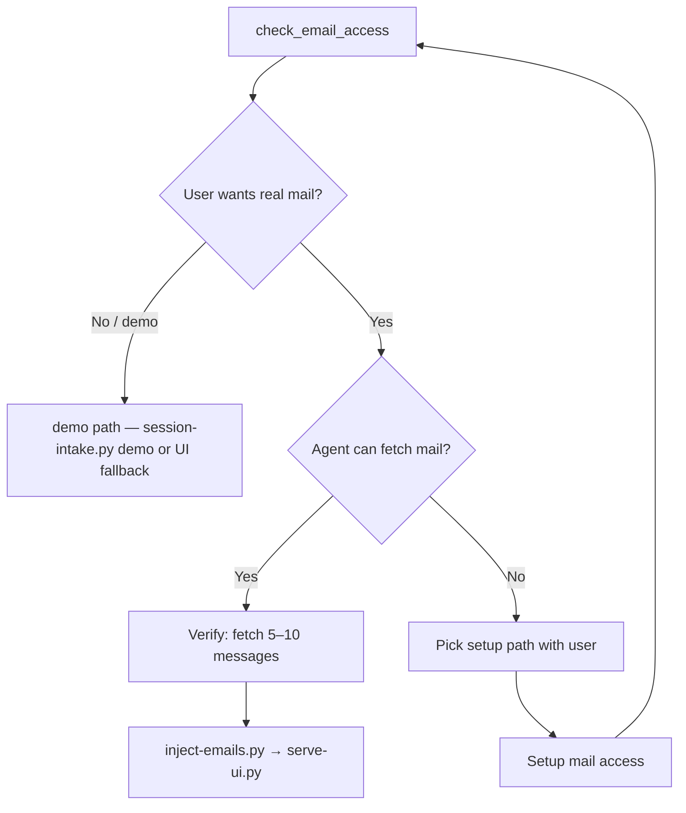

# Email access gate (agent runbook)

The swipe UI **never** talks to email. The **agent** must have mail access before loading a real inbox.

Run this gate **during discovery**, before `confirm` and before `inject-emails.py`.

## Step 1 — Auto-detect

```bash
python scripts/detect-environment.py
# or MCP: check_email_access
```

Read `ready_for_training` and `recommended_provider`.

## Step 2 — Ask the user (always)

Even when auto-detect finds nothing, ask:

1. **"Do I already have access to your email?"** (Gmail MCP, gog, IMAP, Graph, another skill)
2. **"Which provider?"** (Gmail, Outlook, Fastmail, iCloud, Exchange, other)
3. **"Real inbox or demo first?"**

Do not assume. Users often have mail connected to the agent in a way local scripts cannot see.

## Step 3 — Branch



### User wants demo only

- `session-intake.py demo` or `serve-ui.py` with no injected batch
- Say clearly: demo mail does **not** reflect their real sorting habits

### User wants real mail + agent already has access

Use **their** mail tool (not necessarily gog):

1. Fetch 30–50 mixed inbox messages (or folder snapshot for import-sorting)
2. Normalize to batch JSON: `id`, `from`, `subject`, `snippet`, and full sanitized `html` whenever available
3. `inject-emails.py batch.json`
4. Proceed to swipe UI

### User wants real mail + no access yet

Present options in plain language:

| Option | Best when |
|--------|-----------|
| **Connect Gmail via gog** | Local dev, Gmail, user can OAuth in terminal |
| **Use existing Gmail MCP** | Cursor/agent already has Gmail tools |
| **IMAP / Graph / other API** | Outlook, Fastmail, enterprise |
| **Manual batch** | User exports or pastes samples; no live connector |
| **Demo first** | User wants to try UI before connecting mail |

After setup, re-run `check_email_access` and verify a small fetch.

## Step 4 — Verify before inject

Never inject an unverified batch. Confirm you received:

- Stable message `id`
- `from` / sender
- `subject`
- `snippet` or body text
- full sanitized `html` when the provider supports it

If fetch only returns subject lines, **stop and fix mail access** unless the provider truly cannot expose bodies.
If fetch fails, **stop and fix mail access** — do not start `serve-ui.py` with an empty inbox unless the user chose demo.

## Step 5 — Persist verified access (skill memory for this machine)

After a successful fetch, **record per account** so the next session skips rediscovery:

```bash
# Single inbox (no accountId):
python scripts/environment_state.py record \
  --method gog \
  --provider gmail \
  --address you@example.com \
  --fetch-hint 'gog gmail messages search in:inbox -a you@example.com --max 10 -j'

# Unified inbox — one record per accountId slug:
python scripts/environment_state.py record \
  --account-id work-gmail \
  --method gog \
  --provider gmail \
  --address you@company.com \
  --fetch-hint 'gog gmail … -a you@company.com …'

python scripts/environment_state.py record \
  --account-id personal-icloud \
  --method imap \
  --provider icloud \
  --fetch-hint 'imap fetch via user IMAP skill'
```

MCP: `record_email_access` with `accountId` when unified inbox is enabled.

Persists to `~/.config/email-swipe/environment.json` under `emailAccessByAccount`. Registry (who exists) stays in spine `unifiedInbox.accounts`; verified fetch paths stay in environment.

On the next `get_skill_context` / `check_email_access`:
- **Single inbox:** `skipRediscovery` when `_default` is verified
- **Unified inbox:** `skipRediscovery` when **all** registered accounts are verified; partial progress is shown in `accountAccess`

**Do not** store how to open the UI or activation order in host memory — those stay in the skill. Host memory may hold only a pointer: skill path + `get_skill_context`.

## Provider quick reference

See [email-access.md](email-access.md) for config env vars, `setup-config.py`, and provider notes.

| Provider | Typical agent path |
|----------|-------------------|
| Gmail | gog CLI, Gmail MCP, service account |
| Outlook / M365 | Microsoft Graph MCP or API |
| Generic | IMAP skill or script |
| Any | User-built JSON batch → `inject-emails.py` |

## Hard rules

- **Ask before assuming** — local detect may miss MCP-only mail access
- **Demo ≠ real training** — say so when user picks demo
- **No access + real mail requested** — do not proceed to inject; guide setup or offer demo
- **Do not jump straight to the UI** — some users should choose `import-sorting` instead
- **import-sorting** — needs folder/label access, not just inbox; use `fetch_folder_snapshot.py` when gog is available
