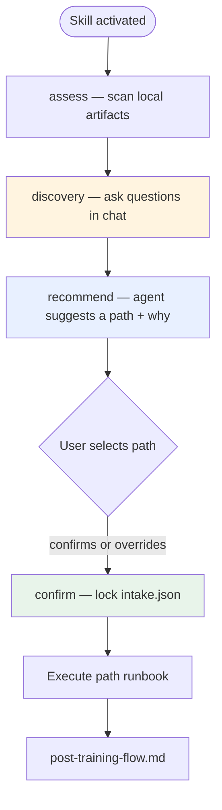

# Session intake (agent runbook)

**Run this before any email injection or `serve-ui.py`.** The user should not pick a path alone — the agent discovers context, recommends, then lets them choose.

**UI:** One page only — `index.html` at the Desktop URL from `serve-ui.py`. Demo mode injects sample mail; there is no `demo.html`. Gitignored files in `assets/ui/` after sessions are normal — ignore them.

**Email:** The UI never fetches mail. Run `check_email_access` during discovery. See [email-access-gate.md](email-access-gate.md).
**Goal:** Train the agent to sort the user's inbox correctly. The UI is optional; `import-sorting` is a first-class path when the user already organizes mail in folders.

## Phases (do not skip or reorder)



| Phase | Agent action | User action |
|-------|--------------|-------------|
| **context** | `get_skill_context` | None |
| **email gate** | `check_email_access` + ask mail-access questions | Answer provider + real vs demo |
| **assess** | `session-intake.py assess` or MCP `session_intake_assess` | None yet |
| **discovery** | Ask questions from assess output; listen | Answer in chat |
| **recommend** | `session-intake.py discover '{...}'` then `recommend` | Read recommendation |
| **confirm** | `session-intake.py confirm <path>` only after user chooses | Pick bootstrap, calibrate, refine, or import-sorting |
| **execute** | Path-specific steps below | Swipe when UI is ready |

**Hard rule:** Do not run `inject-emails.py` or `serve-ui.py` until phase is `confirmed`.
**Hard rule:** Do not fetch subject-line-only training mail when full HTML/body is available.

---

## Unified inbox (optional — advanced setting)

When the user enables **Unified inbox** in **Advanced settings**:

1. Read [unified-inbox.md](unified-inbox.md) — do not host mail; train one account per session.
2. `list_mail_accounts` (MCP) or `assess` → `unifiedInbox` for registered mailboxes.
3. Register accounts in chat (`set_mail_accounts`) — **do not** prompt for life context, calendar, or projects (that is the user's agent scope).
4. Each inject batch must include `metadata.accountId` and optional `accountLabel`.
5. Repeat train → compile per account; present one merged brief at the end.

If unified inbox is **off**, treat as single-mailbox training (default).

## Remote access (optional — Access tab)

When the user enables **Explore remote access** in Settings → Access:

1. Read [remote-access-power-user.md](remote-access-power-user.md).
2. `assess` → `access.exploreRemoteReachability` and `access.agentAction`.
3. Recommend **same always-on host** for agent + MCP + `serve-ui.py` (Tailscale or VPS).
4. Email Swipe does **not** host the UI — user operates tunnel/VPN/stack.
5. Help with fixed port, HTTPS, Add to Home Screen, and verifying compile from remote browser.

---

## CLI / MCP

```bash
python scripts/session-intake.py assess
python scripts/session-intake.py discover '{"hasExistingRules":true,"rulesSource":"agent_memory","goal":"import_rules"}'
python scripts/session-intake.py recommend
python scripts/session-intake.py confirm calibrate
python scripts/session-intake.py demo   # evaluator shortcut — skip intake, inject demo mail
python scripts/session-intake.py get
```

MCP tools: `get_skill_context`, `check_email_access`, `record_email_access`, `session_intake_assess`, `session_intake_discover`, `session_intake_recommend`, `session_intake_confirm`, `get_intake_state`, `session_intake_demo`, `learn_from_folders`, `fetch_folder_snapshot`

State file: `~/.config/email-swipe/intake.json`

---

## Discovery conversation (required)

Ask **at least three** of these before recommending. Adapt based on `assess` signals.

1. **Prior training:** “Have you used Email Swipe on this machine before, or is this new?”
2. **Existing rules:** “Do you already have email rules — filters, labels, or habits you use with me — we should import?”
3. **Goal:** “What’s the main inbox problem — promo noise, missing important mail, vendor pitches?”
4. **Current sorting:** “Do you already sort mail into folders the way you want, so I should learn from that instead of using the UI?”
5. **Demo vs real:** “Want demo emails to learn the UI first, or load your real inbox?”
6. **Deployment:** “Desktop browser, phone on same Wi‑Fi, or something else?”

If `trainingGapCount > 0` in signals, also ask:

> “Last training flagged areas I’m still uncertain about. Want a short refine session on those?”

Save answers with `discover` before `recommend`.

---

## Recommend + choose (required interaction)

After discovery, run `recommend`. Present:

1. **Your suggestion** — one path + plain reason
2. **All four options** — user can override
3. **Explicit ask:** “Which path do you want?”

Example:

> I recommend **calibrate**: you already have rules with me, so we should import them and only swipe emails I’m not confident about.
>
> - **bootstrap** — swipe a broad sample to learn from scratch  
> - **calibrate** (recommended) — import rules, swipe edge cases only  
> - **refine** — short session on specific gaps from prior training  
> - **import-sorting** — no swiping; learn from folders you've already organized  
>
> Which path do you want?

Wait for an answer. Then `confirm <path>`.

---

## Three paths (after confirm)

### Bootstrap

**For:** New users, no rules, first-time training.

1. `setup-agent.py` if needed  
2. Fetch broad inbox sample (or demo) with full sanitized HTML/body whenever available  
3. `inject-emails.py` with `"sessionMode": "bootstrap"` in batch metadata  
4. `serve-ui.py` → user swipes 30–50  
5. `post-training-flow.md`

### Calibrate

**For:** User already has rules (agent memory, filters, verbal rules).

1. **Import rules** — agent documents rules in chat, writes seeded `policy-graph.json` (future: `seed_policy_graph` MCP) with `userConfirmed: true`, `source: "imported"`  
2. `compile_training` or brief that lists imported rules  
3. Agent scores recent inbox → pick **low-confidence only** (target 10–20 emails), with full sanitized HTML/body whenever available  
4. `inject-emails.py` with per-email `predictedAction`, `predictionConfidence`, `"sessionMode": "calibrate"`  
5. `serve-ui.py` → user corrects agent judgment  
6. `post-training-flow.md` — emphasize corrections vs cold start  

### Refine

**For:** Prior training exists; `calibration.json` or `trainingGaps` show weak areas.

1. Read `get_calibration` + `get_policy_graph`  
2. Name the gap (“vendor pitches”, “inconsistent sender X”)  
3. Inject 5–15 emails targeting that gap, `"sessionMode": "refine"`, with full sanitized HTML/body whenever available  
4. Short swipe session → recompile → compare calibration  

### Import sorting (no UI)

**For:** User says *"my inbox is already sorted — learn from my folders"* and prefers not to swipe.

**Confirm first:** offer it as a choice (don't assume), and warn that folders may hold stale/lingering mail or outdated choices. Always preview before applying.

1. Fetch folders + a sample of mail in each → build a folder snapshot  
2. `learn_from_folders { folders, preview: true }` → review the plan with the user  
3. On confirmation → `learn_from_folders { folders, preview: false }` (writes prefs + compiles)  
4. Present `assistant-brief.md`; build routes out per `platform-rules.json → folderRoutes`  

Full runbook: `references/paths/import-sorting.md`

---

## Prior knowledge the agent should use

Before asking questions, check:

| Source | What it tells you |
|--------|-------------------|
| `intake.json` | In-progress or confirmed path |
| `policy-graph.json` | Existing policies, gaps, imported rules |
| `calibration.json` | Agreement %, inconsistent senders |
| `preferences.json` | Prior swipe count |
| Agent memory / chat | Rules never written to disk |
| User’s mail tools | Filters, labels (rules-first signal) |

Recommendation logic favors:

- No artifacts → **bootstrap**  
- Rules + import goal → **calibrate**  
- Gaps / low agreement → **refine**  
- Already-sorted folders + prefers no UI → **import-sorting** (preview first)  

User always gets the final say.

---

## Path runbooks (after confirm)

| Path | Runbook |
|------|---------|
| bootstrap | `references/paths/bootstrap.md` |
| calibrate | `references/paths/calibrate.md` + `scripts/seed_policy_graph.py` |
| refine | `references/paths/refine.md` |
| import-sorting | `references/paths/import-sorting.md` + `scripts/learn_from_folders.py` (no UI) |
| Advanced folders | `references/paths/advanced-folders.md` (unlock in **Advanced settings**) |

---

## Inject metadata (all paths)

When building the email batch, include:

```json
{
  "metadata": {
    "sessionMode": "bootstrap",
    "intakePath": "bootstrap",
    "confirmedAt": "2026-07-07T12:00:00Z"
  },
  "emails": [
    {
      "id": "msg-001",
      "predictedAction": "spam",
      "predictionConfidence": 0.62,
      "agentNote": "Similar promos were don't keep, but this sender mixed."
    }
  ]
}
```

`calibrate` and `refine` batches should include predictions; `bootstrap` may omit them.

---

## Example: rules-first user

**Signals:** no local policy-graph; user says they have rules in agent memory.

**Discovery:** has rules ✓, goal = import + fix uncertain, real inbox ✓

**Recommend:** calibrate

**User:** “Yes, calibrate”

**Execute:** agent writes imported rules → seeds policy-graph → injects 12 low-confidence emails → serve-ui → post-training brief focuses on corrections

---

## See also

- `references/intake.example.json` — intake state shape  
- `references/post-training-flow.md` — after swiping  
- `SKILL.md` — skill entry point
