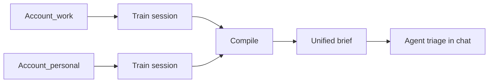

# Unified inbox (multiple accounts)

Email Swipe is **local-first**. You keep reading mail in Gmail, Apple Mail, Outlook, or whatever you already use. Unified inbox means your **agent** learns separate sorting rules per mailbox and merges them into **one operating brief**.

We do **not** host your mail. We do **not** replace your mail app.

## When to turn this on

Enable **Unified inbox** in **Advanced settings** when you have **more than one mailbox** you want the same agent to sort — for example work Gmail + personal iCloud.

Leave it off if you only train one inbox. Single-account users see no difference.

## What it looks like (before → after)

| Stage | What you have |
|-------|----------------|
| **Before** | One generic agent; promos and important mail treated the same across accounts |
| **Per-account training** | 15–30 minutes per mailbox — swipe or import-sorting, one account at a time |
| **After compile** | One `assistant-brief.md` with sections per account + shared rules where they overlap |
| **Daily use** | Ask your agent: *"What needs me across my inboxes?"* — it reads the brief and fetches mail via **your** connectors |

**Trained does not mean your inboxes are empty.** It means the agent knows your rules and can recommend actions. You still read mail in your normal apps.

## How training works

1. Turn on **Unified inbox** in **Advanced settings** and read this doc.
2. Register accounts with your agent (in chat) — see account shape below.
3. **One session per account.** Each inject batch includes `metadata.accountId`.
4. After each session, compile runs. Policies accumulate with account tags.
5. When all accounts are trained, agent presents the **unified brief** and enters recommend-only mode.



## Account registry (agent maintains)

Stored in `settings.json` under `unifiedInbox`:

```json
{
  "unifiedInbox": {
    "enabled": true,
    "defaultAccountId": "work-gmail",
    "accounts": [
      {
        "id": "work-gmail",
        "label": "Work Gmail",
        "provider": "gmail",
        "role": "work",
        "address": "you@company.com",
        "connectorHint": "gog | gmail-mcp"
      },
      {
        "id": "personal-icloud",
        "label": "Personal iCloud",
        "provider": "icloud",
        "role": "personal",
        "address": "you@me.com",
        "connectorHint": "imap"
      }
    ]
  }
}
```

| Field | Purpose |
|-------|---------|
| `id` | Stable slug — used in batch metadata and policies |
| `label` | Human name shown in UI badge and brief |
| `provider` | gmail, outlook, icloud, imap, other |
| `role` | work, personal, side_project — optional hint for agent |
| `connectorHint` | How **your agent** fetches this account (not Email Swipe) |

The user registers accounts in conversation with their agent. Email Swipe does not OAuth or store passwords.

## Inject batch (per account)

```json
{
  "metadata": {
    "sessionMode": "bootstrap",
    "accountId": "work-gmail",
    "accountLabel": "Work Gmail"
  },
  "emails": []
}
```

CLI:

```bash
python scripts/inject-emails.py work-batch.json
python scripts/serve-ui.py
```

Open the Desktop URL — header shows which account you are training.

## Mail access by provider

| Provider | Typical connector | Notes |
|----------|-------------------|--------|
| Gmail | gog CLI, Gmail MCP | Full HTML preferred |
| Outlook / M365 | Microsoft Graph MCP | OAuth via user's agent setup |
| iCloud | IMAP + app-specific password | No public REST API — user keeps Apple Mail for reading |
| Fastmail / other | IMAP | Universal fallback |

See [email-access-gate.md](./email-access-gate.md). Verify fetch **per account** before inject.

## Agent runbook (multi-account)

1. Confirm unified inbox is enabled (`get_skill_context` or `settings.json`).
2. List registered accounts — add any missing via chat.
3. Pick training order (noisiest inbox first).
4. For each account: verify mail access → **`record_email_access` with `accountId`** → build batch with `metadata.accountId` → inject → user swipes → compile.
5. After last account: `get_policy_brief` — confirm per-account sections with user.
6. Ongoing: fetch each account separately; merge recommendations in chat.

**Two stores:** `settings.json` / spine = who is registered (`set_mail_accounts`). `environment.json` = verified fetch per `accountId` (`record_email_access`).

MCP: `list_mail_accounts` returns the registry from settings. `check_email_access` merges registry + `emailAccessByAccount`.

## Life context — not our job

If the user's agent already knows calendar, projects, or relationships, it should use that when recommending. **Email Swipe does not prompt for life story.** That scope belongs to the user's agent as a whole.

## What we do not do

- Host or sync mailboxes on Email Swipe servers
- Show all accounts in one swipe queue (train one at a time)
- Require Nylas, Render, or any specific vendor
- Auto-apply labels without user approval (recommend-only default)

## Related docs

- [your-agent-before-and-after.md](./your-agent-before-and-after.md) — user-facing journey
- [deployment.md](./deployment.md) — local-first setup
- [paths/import-sorting.md](./paths/import-sorting.md) — no-UI path per account
